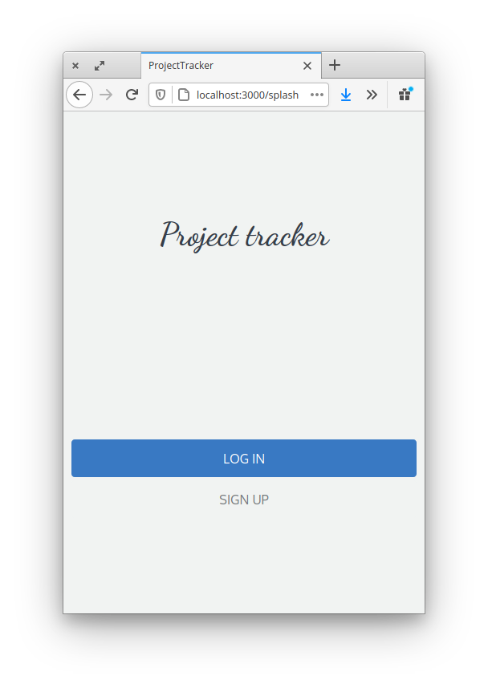
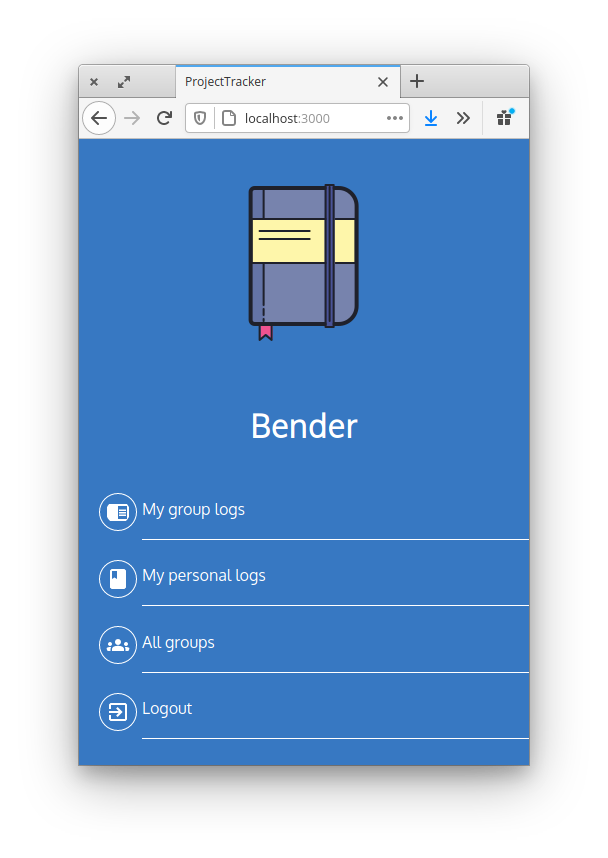

# Project Tracker




> Time tracker to keep records on how much time is spent in certain projects
 -Anyone can anotate their activities in the created groups
 -You can keep track of your personal projects in private


## Built With

- Ruby v2.7.2
- Rails 6.0.3.4

## Live version

You can view the live version here
https://pt324.herokuapp.com/

## Getting Started


To get a local copy up and running follow these simple example steps.

Clone the repository to yout local machine

```
git clone git@github.com:AdfPizarro/projectTracker.git
```
By default is configured to run with sqlite to make easy to test, however
is ready to deploy just by changing the adapter configuration to posrgress
by editing the file confing/databse.yml

```
adapter: sqlite3
```
 to

```
adapter: postgresql
```

### Prerequisites

Ruby: 2.6.3
Rails: 5.2.3
Postgres: >=9.5

### Setup

Instal gems with:

```
bundle install
```

Setup database with:

```
   rails db:create
   rails db:migrate
```

### Usage

Start server with:

```
    rails server
```

Open `http://localhost:3000/` in your browser.

### Run tests

The tests checks the functionalities of creating and accepting friend requests
by using capybara you can run it by the followng command


```
    rspec --format documentation
```


## Authors

 **Adrian Flores Pizarro**

- Github: [@AdfPizarro](https://github.com/AdfPizarro)
- Twitter: [@AdfPizarro](https://twitter.com/adfpizarro)
- Linkedin: [adrian-flores-pizarro-73b62316a](https://www.linkedin.com/in/adrian-flores-pizarro-73b62316a/)

## 🤝 Contributing

Contributions, issues and feature requests are welcome!

Feel free to check the [issues page](issues/).

## Show your support

Give a ⭐️ if you like this project!

## Acknowledgments

Design by [Gregoire Vella](https://www.behance.net/gregoirevella)
